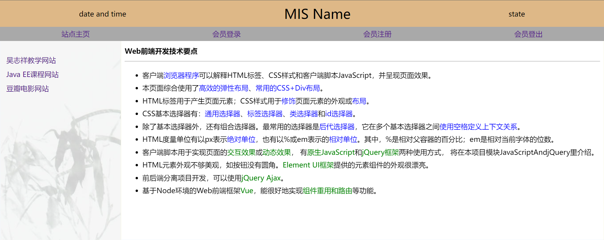
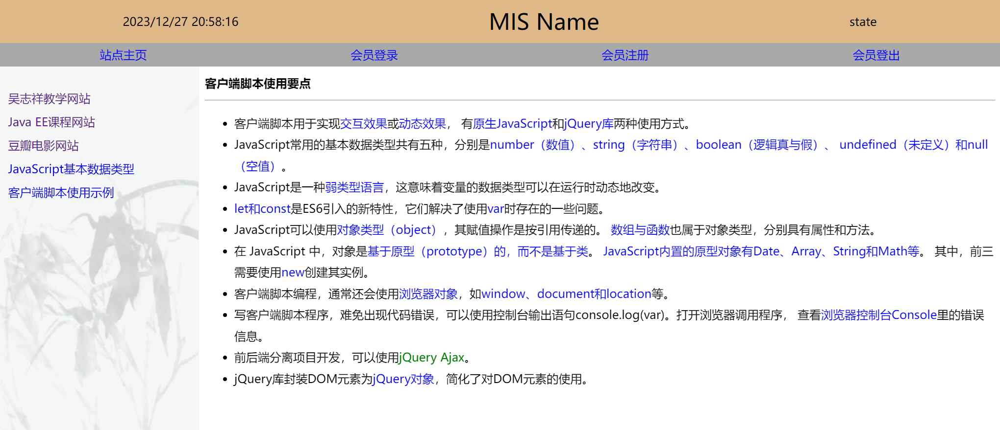
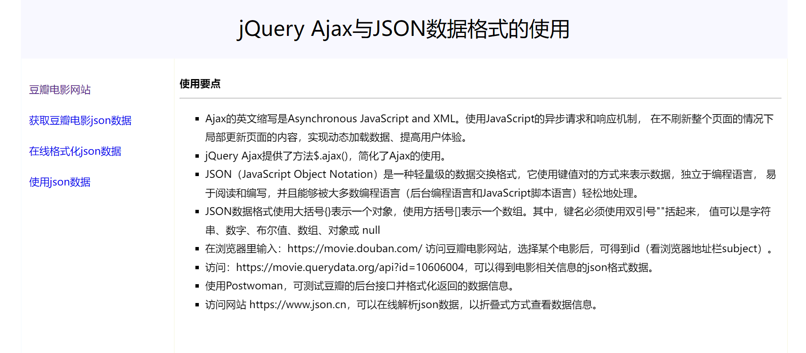
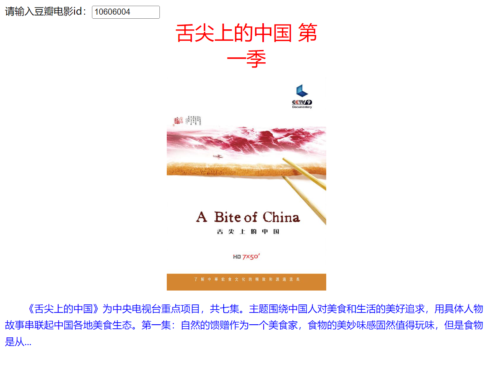
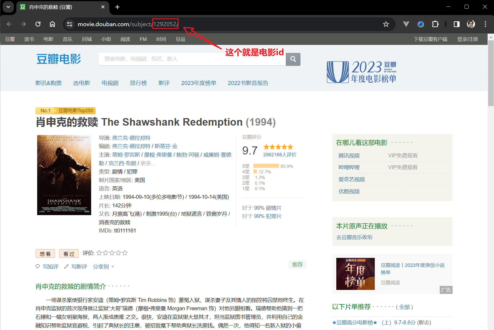
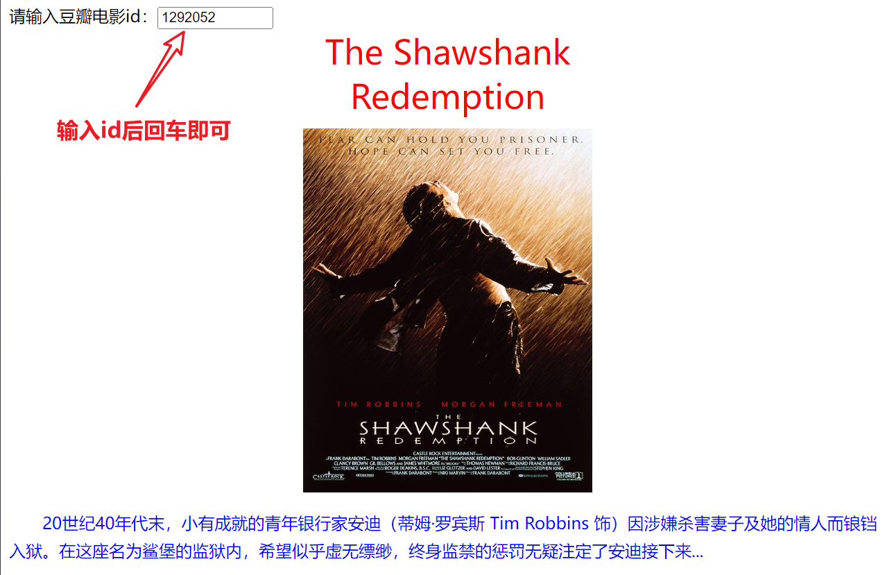

<div align="center">

<h1>Web开发基础</h1>

</div>


# 目录

- [目录](#目录)
- [1. Web前端技术及其发展](#1-web前端技术及其发展)
- [2. Java EE开发环境](#2-java-ee开发环境)
  - [2.1 IDEA 2023](#21-idea-2023)
  - [2.2 常用快捷操作](#22-常用快捷操作)
- [3. Web前端基础](#3-web前端基础)
  - [3.1 HTMLAndCSS项目](#31-htmlandcss项目)
  - [3.2 JavaScriptAndjQuery项目](#32-javascriptandjquery项目)
    - [3.2.1 知识点](#321-知识点)
    - [3.2.2 代码学习](#322-代码学习)
  - [3.3 jQuery Ajax项目 — douban](#33-jquery-ajax项目--douban)
    - [3.3.1 知识点](#331-知识点)
    - [3.3.2 代码学习](#332-代码学习)
- [4. 前端框架](#4-前端框架)
  - [4.1 Node.js与Vue.js概述](#41-nodejs与vuejs概述)
  - [4.2 关于Node](#42-关于node)
  - [4.3 Node.js使用示例](#43-nodejs使用示例)
  - [4.4 使用IDEA 2023创建Vue3项目](#44-使用idea-2023创建vue3项目)
  - [4.5 认识Vite+Vue3项目结构](#45-认识vitevue3项目结构)
  - [4.6 Vue3项目工作原理](#46-vue3项目工作原理)
    - [核心组件：App.vue](#核心组件appvue)
    - [入口文件：main.js](#入口文件mainjs)
    - [项目打包与部署](#项目打包与部署)
    - [生产环境部署](#生产环境部署)
  - [4.7 在命令行方式下运行 Vite+Vue3 项目](#47-在命令行方式下运行-vitevue3-项目)
- [5. Vue 3基础语法示例项目](#5-vue-3基础语法示例项目)
  - [](#)


# 1. Web前端技术及其发展

1. **网络应用体系结构演变：**
   - 传统`C/S`（客户端/服务端）架构向`B/S`（浏览器/服务端）架构的演变。
   - `S`代表服务端，`C`代表客户端，`B`代表浏览器。

2. **网页设计技术：**
   - `HTML+CSS+JavaScript`是原生的网页设计技术。
   - `HTML`提供标签用于设计页面元素。
   - `CSS`用于修饰页面元素外观和进行布局。
   - `JavaScript`实现页面的交互效果或动态效果。

3. **浏览器开发者工具：**
   - 浏览器程序通过解释`.html`文档代码呈现页面。
   - 使用开发者模式，按功能键`F12`进入，有助于调试`Web`项目。
   - `Google`浏览器是推荐的用于Web项目调试的浏览器。

4. **前端技术库和框架：**
   - `jQuery`是`JavaScript`库，简化`JavaScript`的使用。
   - `Vue3+Element Plus`是基于`Node`的新`Web`前端框架技术。
   - `Vue3+Element Plus`提供高效的代码复用，使界面更加美观。

5. **技术术语解释：**
   - `HTML`是超文本标记语言，用于设计页面元素。
   - `CSS`是层叠样式表，用于修饰页面元素外观和进行布局。
   - `JavaScript`是一种脚本语言，用于实现页面的交互效果或动态效果。

事实上，JavaWeb开发涵盖了前端和后端技术，通过不断演进的体系结构和新技术，提供了更高效、美观的Web应用开发解决方案。

> [返回目录 ↑ ](#目录)
>
---

# 2. Java EE开发环境

## 2.1 IDEA 2023

1. **IntelliJ IDEA概述：**
   - `IntelliJ IDEA`是由`JetBrains`公司开发的集成开发环境（`IDE`）。
   - 公司总部位于捷克共和国的首都布拉格。
   - `JetBrains`以严谨著称的东欧程序员为主。

2. **应用领域：**
   - `IntelliJ IDEA`可用于`Java`项目、`Java EE`项目和`Spring Boot`项目的开发。
   - 也可作为`Web`前端项目的集成开发环境。

3. **下载和访问：**
   - 访问[JetBrains官网](http://www.jetbrains.com/idea/)，可以找到`IntelliJ IDEA`的下载链接。

4. **版本和许可：**
   - `IDEA`有多个版本，其中社区版（`Community`）是免费的，但功能有限制。
   - 社区版适用于`Java`开发，但不能进行`Java EE`开发。
   - 终极版（`Ultimate`）是收费版本，功能无限制。
   - 终极版有免费试用版（`EAP`），可免费使用一个月。
   - 持有`edu`邮箱的用户，申请帐号后可免费使用终极版一年。

5. **效率和方便性：**
   - 相对于免费的`Eclipse-JEE`，`IntelliJ IDEA`在使用上更加方便，提高开发效率。

小结：IntelliJ IDEA是一款强大的集成开发环境，广泛用于Java和Web开发，提供了方便、高效的开发工具，尤其在东欧程序员中有较高的声誉。

> [返回目录 ↑ ](#目录)
>
---

## 2.2 常用快捷操作

1. **双击选词：** 通过双击可以选择一个单词。
2. **`Ctrl+C`：** 复制选中的内容。
3. **`Ctrl+V`：** 粘贴已复制的内容。
4. **`Ctrl+X`：** 剪切选中的内容。
5. **`Ctrl+D`：** 复制当前行至下一行，相当于复制和粘贴两个操作的组合。
6. **`Ctrl+Y`：** 删除光标所在的当前行，无需先拖拽选取，操作迅速。
7. **代码注释及取消：**
   - 单行注释：`Ctrl+Shift+/`
   - 取消单行注释：`Ctrl+/`
8. **重写（实现）接口方法或抽象方法：** 使用联机提示或快捷键`Ctrl+O`。
9. **`Alt+回车`：** 提供自动修正错误、自动导包、实例提示等功能。
10. **`Ctrl+H`：** 查看类或接口的继承关系。
11. **参数提示：** 在方法调用时使用`Ctrl+P`来显示参数提示。
12. **接口方法体生成：** 在接口中模糊输入方法名后选择。
13. **显示类或程序结构：** 单击左侧工具`Structure`按钮。
14. **当前代码查找：**
    - 局部查找：`Ctrl+F`
    - 全局查找：`Ctrl+Shift+F`

> [返回目录 ↑ ](#目录)
>
---

# 3. Web前端基础

`Web`前端基础主要涵盖`HTML5`、`CSS3`以及`客户端脚本`等部分：

1. **HTML5（超文本标记语言第五版）：**
   - `HTML5`是用于构建和呈现Web页面内容的标记语言。
   - 引入了一系列新的语义化标签，如`<header>`、`<nav>`、`<section>`等，使页面结构更清晰。
   - 提供了新的表单元素，多媒体支持（如`<audio>`和`<video>`），以及本地存储能力。
   - 支持`Canvas`和`SVG`等图形技术，使得在`Web`页面上绘制图形和动画更为灵活。

2. **CSS3（层叠样式表第三版）：**
   - `CSS3`用于样式化`HTML`元素，实现页面的外观和布局设计。
   - 引入了新的选择器，如属性选择器、伪类和伪元素，增强了样式选择的灵活性。
   - 提供了过渡（`Transition`）和动画（`Animation`）等功能，实现页面元素的平滑过渡和动态效果。
   - 引入了`Flexbox`和`Grid`等布局模型，使得页面布局更为直观和灵活。

3. **客户端脚本：**
   - 客户端脚本通常指的是`JavaScript`，是一种用于在`Web`浏览器中实现交互性和动态效果的脚本语言。
   - 可以通过嵌入在HTML中的`<script>`标签引入。
   - 用于响应用户的操作，处理表单验证、页面动态变化和与服务器的异步通信（`AJAX`）等。
   - 现代的前端开发中，常使用一些流行的`JavaScript`框架和库，如`React`、`Vue.js`和`Angular`，来简化开发和提高代码的可维护性。

> [返回目录 ↑ ](#目录)
>

---

## 3.1 HTMLAndCSS项目

项目地址：[HTMLAndCSS项目](https://github.com/zheng-yi-yi/Java-Web-learning/tree/main/code/school/unit1-Web-Development-Basics/HTMLAndCSS)

项目主页：



项目知识点如下：

1. **标签：**
   - `<meta>`: 用于设置`HTML`文档的元数据，如字符集等。
   - `<title>`: 定义文档的标题。
   - `<div>`: 用于定义`HTML`文档中的分区或区块，常用于组织和布局页面内容。
   - `<a>`: 定义超链接。

2. **属性：**
   - `charset`: 设置字符集，通常用于 `<meta>` 标签。
   - `id`: 用于唯一标识`HTML`元素。
   - `href`: 定义超链接的目标地址。
   - `target`: 定义超链接的打开方式，如在新窗口中打开 (`_blank`)。
   - `src`: 定义嵌入的资源的地址，如 `<iframe>` 中的网页地址。
   - `name`: 为 `<iframe>` 定义一个名称，以便其他链接可以在该框架中打开。

3. **选择器：**
   - `*`: 通用选择器，选择所有元素。
   - `#`: `ID`选择器，选择具有特定`ID`的元素。
   - `.`: 类选择器，选择具有特定类的元素。

4. **度量单位：**
   - `%`: 百分比单位，相对于父元素的大小。
   - `em`: 相对于当前字体尺寸的单位。
   - `px`: 像素，绝对长度单位。

5. **CSS+Div布局：**
   - `box-sizing`: 定义盒模型的`-sizing`属性，常用于保持元素大小的稳定和可控。
   - `margin`, `padding`: 外边距和内边距，用于控制元素与其他元素之间的空间。
   - `float`: 定义元素的浮动方式，用于实现元素的水平并排。
   - `background-image`: 设置元素的背景图片。

6. **弹性布局：**
   - `display: flex;`: 定义弹性容器，使其子元素成为弹性项，实现灵活的布局。
   - `justify-content`: 定义弹性容器中子项的水平排列方式。
   - `align-items`: 定义弹性容器中子项的垂直对齐方式。

> [返回目录 ↑ ](#目录)

---

## 3.2 JavaScriptAndjQuery项目

项目地址：[JavaScriptAndjQuery项目](https://github.com/zheng-yi-yi/Java-Web-learning/tree/main/code/school/unit1-Web-Development-Basics/JavaScriptAndjQuery)

项目主页：



### 3.2.1 知识点

1. **客户端脚本：**
   - 客户端脚本能够被浏览器程序解释执行，用于实现交互效果或动态效果。
   - 有原生`JavaScript`和`jQuery`库两种使用方式。
   - 在页面中使用成对的`<script>…</script>`标签定义客户端脚本。
   - 在客户端脚本中，可以使用浏览器对象或JavaScript内置对象。

2. **jQuery库：**
   - 引入`jQuery`库后，可以使用`$(选择器)`将页面元素对象转换成`jQuery`对象。
   - `jQuery`是原生`JavaScript`的脚本库，简化了`DOM`操作、事件处理和`AJAX`等操作。

3. **Web存储（localStorage和sessionStorage）：**
   - `HTML5`对`window`对象增加了属性`localStorage`和`sessionStorage`，以及方法`openDatabase()`，是客户端存储数据的一种新方式，统称为Web存储。
   - `localStorage`用于永久存储数据，可被同一域名下的所有页面访问。
   - `sessionStorage`用于在当前会话期间存储数据，在浏览器会话结束时会被自动清除。
   - 这两者常用于浏览器会话存储，`JWT`（`JSON Web Token`）技术也需要使用`sessionStorage`对象。

4. **Web存储的常用方法：**
   - `setItem(key, value)`：向存储添加一个键值对。
   - `getItem(key)`：从存储中获取键名对应的值。
   - `removeItem(key)`：从存储中移除键名对应的键值对。

5. **JavaScript基本数据类型：**
   - 数值（`number`）、字符串（`string`）、逻辑真与假（`boolean`）、未定义（`undefined`）、空值（`null`）。
   - J`avaScript`是一种弱类型语言，变量的数据类型可以在运行时动态地改变。

6. **let和const：**
   - `ES6`引入的新特性，解决了使用`var`时存在的一些问题。
   - `let`用于声明变量，可被重新赋值。
   - `const`用于声明常量，一旦赋值就不能再改变。

7. **对象类型和引用传递：**
   - J`avaScript`可以使用对象类型（`object`），其赋值操作是按引用传递的。
   - 数组和函数也属于对象类型，具有属性和方法。
   - 对象是基于原型（`prototype`）的，而不是基于类。
   - `JavaScript`内置的原型对象有`Date`、`Array`、`String`和`Math`等，其中前三需要使用`new`创建其实例。

8. **浏览器对象：**
   - 在客户端脚本编程中，通常会使用浏览器对象，如`window`、`document`和`location`等。

9. **调试和错误处理：**
   - 代码错误时，可以使用`console.log(var)`在控制台输出信息。
   - 打开浏览器调试工具，查看控制台Console里的错误信息。

10. **前后端分离项目开发：**
   - 可以使用`jQuery Ajax`简化前后端交互。

> [返回目录 ↑ ](#目录)

---


### 3.2.2 代码学习

首先，`index.html` 页面中有一个元素：

```html
<div id="dtps">date and time</div>
```

这里定义了一个具有`id`属性为`"dtps"`的`div`元素，初始显示文本为`"date and time"`。

现在，我们要在页面中显示实时的日期和时间。

方法一：使用**原生的方式**来更新页面上的时间显示

我们来看这段`JavaScript`代码：

```javascript
// (1) 得到 DOM对象
let dtps=document.getElementById("dtps")
// (2) 定义函数，刷新页面元素
function displayDT(){
   dtps.innerHTML=new Date().toLocaleString()
}
// (3) 实时时间显示
window.setInterval("displayDT()",1000)
```

记录：

- `let dtps=document.getElementById("dtps")`: 使用`JavaScript`获取`id`为"`dtps`"的元素对象，并将其赋值给变量`dtps`。
- `function displayDT() { ... }`: 定义了一个名为`displayDT`的函数，该函数用于更新页面上`id`为"`dtps`"的元素内容。
- `dtps.innerHTML=new Date().toLocaleString()`: 在`displayDT`函数中，通过`innerHTML`属性将元素的内容更新为当前日期和时间，使用toLocaleString方法以本地格式显示日期和时间。
- `window.setInterval("displayDT()",1000)`: 使用`setInterval`方法（定时执行指定的函数），每隔`1000`毫秒（即`1`秒）调用一次`displayDT`函数，实现实时更新。

这是使用原生JavaScript方式。

方法二是使用`jQuery`库的方式，可以极大简化操作。

注意，如果使用`jQuery`方式，需要先引入`jQuery`库文件：

```html
<!--引入了jQuery库，使得页面中可以使用jQuery的功能 -->
<script src="js/jquery-1.10.2.min.js"></script>
```

下面，使用`jQuery`选择器和方法来操作DOM元素。

```javascript
// (1) 将DOM元素封装成jQuery对象
let dtps = $("#dtps")
// (2) 定义JavaScript函数的另一种方式，属于对象类型
let displayDateAndTime = function () {
   // Date是JavaScript内置的动态对象
   let dt = new Date().toLocaleString()
   // 刷新页面元素
   dtps.html(dt)
}
// (3) 调用window对象的定时器方法，实现实时时间显示
window.setInterval(displayDateAndTime, 1000)
```

- `let dtps = $("#dtps")`: 使用`jQuery`选择器将`ID`为 "`dtps`" 的元素封装成`jQuery`对象，以便后续操作。
- `let displayDateAndTime = function () { ... }`: 定义一个函数 `displayDateAndTime`，用于获取当前时间并更新页面元素。
- `new Date().toLocaleString()`: 获取当前时间，并将其转换为字符串形式，包括日期和时间。
- `dtps.html(dt)`: 使用`jQuery`的`html`方法将获取到的时间字符串更新到页面元素中。
- `window.setInterval(displayDateAndTime, 1000)`: 使用`setInterval`方法，每隔`1`秒（1000毫秒）执行一次 `displayDateAndTime` 函数，实现实时更新时间的效果。

对比如下：

| 操作         | 原生JavaScript                             | jQuery                         |
| ------------ | ------------------------------------------ | ------------------------------ |
| DOM对象获取  | 使用 `document.getElementById` 获取DOM元素 | 使用 `$` 函数来选择DOM元素     |
| 刷新页面元素 | 使用 `innerHTML` 属性更新元素内容          | 使用 `html()` 方法更新元素内容 |

---

这里看一下**浏览器会话存储**知识点。代码如下：

```html
<meta charset="UTF-8" />
<title>浏览器存储localStorage与localStorage</title>
<script>
    // 检测浏览器是否支持sessionStorage
    let ss = window.sessionStorage; // 获取本地会话存储对象

    if (ss) {
        // 如果支持sessionStorage
        document.writeln("浏览器支持sessionStorage! <br/>");

        // 使用sessionStorage存储数据
        ss.setItem("kc1", "Android开发");

        // 提示用户查看sessionStorage信息的方法
        document.writeln("打开浏览器调试，从【Application】选项查验已经建立的sessionStorage信息...<br/>");
        
        // 提示用户关闭浏览器后再打开站点，不能看到sessionStorage信息。
        document.writeln("关闭浏览器后再打开站点，不能看到sessionStorage信息。");
    } else {
        // 如果不支持sessionStorage，则弹出提示
        alert("浏览器不支持sessionStorage! ");
    }

    // 检测浏览器是否支持localStorage
    let ls = window.localStorage; // 获取本地存储对象

    if (ls) {
        // 如果支持localStorage
        document.writeln("<hr/>");
        document.writeln("浏览器支持localStorage ! <br>");

        // 使用localStorage存储数据
        ls.setItem("kc2", "Java桌面开发");
        ls.setItem("kc3", "Java EE开发");

        // 提示用户查看localStorage信息的方法
        document.writeln("打开浏览器调试，从【Application】选项查验已经建立的localStorage信息... <br/> ");
        
        // 提示用户关闭浏览器后再打开站点而不必访问本页面，仍然可查验到localStorage信息。
        document.writeln("关闭浏览器后再打开站点而不必访问本页面，仍然可查验到localStorage信息。");
    } else {
        // 如果不支持localStorage，则弹出提示
        alert("浏览器不支持localStorage! ");
    }
</script>
```

记录：

- 通过`window.sessionStorage`和`window.localStorage`可以获取浏览器的本地会话存储和本地存储对象。
- 使用`setItem`方法向`sessionStorage`和`localStorage`中添加数据。
- 使用`document.writeln`在页面上输出信息，说明浏览器是否支持存储和如何查看存储的数据。
- 如果浏览器不支持`sessionStorage`或`localStorage`，则通过`alert`弹出提示。

> [返回目录 ↑ ](#目录)
> 
---


## 3.3 jQuery Ajax项目 — douban

项目地址：[jQuery Ajax项目 — douban](https://github.com/zheng-yi-yi/Java-Web-learning/tree/main/code/school/unit1-Web-Development-Basics/douban)


主页效果：



### 3.3.1 知识点

1. **Ajax（Asynchronous JavaScript and XML）:**
   - `Ajax`是一种使用`JavaScript`的异步请求和响应机制。
   - 它允许在不刷新整个页面的情况下，通过局部更新页面的内容来实现动态加载数据，提高用户体验。

2. **jQuery Ajax:**
   - `jQuery Ajax`提供了简化`Ajax`使用的方法`$.ajax()`，使得异步请求更加方便。
   - 通过使用`jQuery Ajax`，可以更容易地处理各种`Ajax`请求和处理响应。

3. **JSON（JavaScript Object Notation）:**
   - `JSON`是一种轻量级的数据交换格式，使用键值对的方式来表示数据。
   - 独立于编程语言，易于阅读和编写，并能够被大多数编程语言轻松处理。
   - 使用大括号`{}`表示对象，方括号`[]`表示数组，键名必须使用双引号`""`括起来。

4. **豆瓣电影网站和API:**
   - 访问豆瓣电影网站（`https://movie.douban.com/`），选择电影后可以得到电影的`id`（观察浏览器地址栏的参数）。
   - 通过访问`https://movie.querydata.org/api?id=10606004`，可以获取电影相关信息的`JSON`格式数据。

5. **Postwoman:**
   - `Postwoman`是一个用于测试`API`的工具，可用于测试豆瓣的后台接口并格式化返回的数据信息，地址：[Postwoman](https://github.com/zheng-yi-yi/Java-Web-learning/tree/main/code/school/tools/postwoman.v.1.1.7)

6. **JSON在线解析:**
   - 网站`https://www.json.cn`提供了在线解析`JSON`数据的服务，以折叠式方式查看数据信息，有助于直观地了解JSON结构。

### 3.3.2 代码学习

打开项目中的`useJson.html`页面，效果如下：



> 该项目实现了一个简单的电影信息查询功能。

首先，使用HTML标签定义页面元素，包括文本输入框、标题、海报和描述：

```html
请输入豆瓣电影id：<input type="text" id="idFieId" value="10606004" />
<div id="filmTitle">电影名称</div>

<div id="filmDescription">电影描述</div>
```

接着老样子，引入jQuery库：

```html
<script src="js/jquery-1.10.2.min.js"></script>
<script>
   // js代码...
</script>
```

下面我们来看JS代码。

首先，我们使用了`jQuery`的选择器来获取`HTML`中的不同元素，并将它们存储在相应的变量中，以便后续操作。

```JavaScript
let idFieId = $("#idFieId");                    // 获取文本输入框
let filmTitle = $("#filmTitle");                // 获取电影标题元素
let poster = $("#poster");                      // 获取电影海报元素
let filmDescription = $("#filmDescription");    // 获取电影描述元素
```

下面这个代码，用于页面初始化加载时通过 `getFilmInformation` 方法获取电影信息。同时，监听文本输入框的按键事件，当按下回车键时，同样调用 `getFilmInformation` 方法获取电影信息。

```JavaScript
let idv = idFieId.val();
getFilmInformation(idv);            // 初始加载页面时获取电影信息

idFieId.keyup(function (event) {    // 监听文本输入框按键事件
   if (event.keyCode == 13) {       // 如果按下的是回车键
      id = idFieId.val();           // 获取输入框中的电影ID
      getFilmInformation(id);       // 调用获取电影信息的方法
   }
});
```

下面就是`getFilmInformation()`方法的具体实现，该方法用于编写获取电影信息的`AJAX`请求：

```JavaScript
function getFilmInformation(idv) {
   $.ajax({
      url: "https://movie.querydata.org/api",
      data: {
            id: idv,  // 设置请求参数
      },
      success: function (response) {  // 当请求成功时的处理方法
            console.log("成功响应");
            filmTitle.text(response.originalName);  // 更新电影标题
            poster.attr("src", response.data[0].poster);  // 更新电影海报
            filmDescription.html(response.data[0].description);  // 更新电影描述
      },
      error: function () {  // 当请求出错时的处理方法
            alert("请求的服务接口没有正常响应！\n豆瓣后台接口限制频繁访问，两次请求之间的时间间隔大约需要半分钟。");
      }
   });
}
```

在这一部分，我们使用了`jQuery`的 `ajax` 方法发起异步请求。通过指定 `url` 和 `data` 参数，向豆瓣的电影查询接口发送请求。在请求成功时，通过回调函数处理返回的数据，更新页面上的电影标题、海报和描述。如果请求出错，弹出警告提示。

> - **工作原理**：
>
> 当用户输入豆瓣电影的`ID`并点击回车键或按回车键时，`getFilmInformation()`方法会向后端服务器发送请求，请求参数为`id`。后端服务器会根据`id`查询电影信息，并返回给前端页面。前端页面会将后端服务器返回的信息设置到页面元素上，完成电影信息的显示。





# 4. 前端框架

## 4.1 Node.js与Vue.js概述

`Node.js`和`Vue.js`是两个广泛应用于`Web`开发的`JavaScript`框架，它们分别用于服务器端和客户端开发，提供了不同的功能和用途。

**Node.js**：

- **定义与特点：** `Node.js`是基于`Chrome V8 JavaScript`引擎构建的运行时环境，用于在服务器端构建高性能的网络应用程序。
- **官网及版本获取：** 访问[Node.js官网](https://nodejs.org/)可以获取最新版本，提供下载和安装指南。

**包管理器npm**：

- **功能与优势：** `Node.js`拥有强大的包管理器`npm`，使得开发者能够轻松地使用各种第三方模块和库来构建复杂的服务器应用。
- **加速安装：** 使用淘宝`NPM`镜像源的`cnpm`可以加速`npm`的安装速度，全局安装命令是：`npm install -g cnpm`。

**Vue.js**：

- **定义与用途：** `Vue.js`是轻量级的`JavaScript`框架，专用于构建交互式的用户界面，采用**组件化**的开发方式，支持**响应式的数据绑定**。
- **核心特性：** 提供**路由管理**、**状态管理**和**构建工具**等功能，使得前端开发更加简便和高效。

**Vue.js前端开发**：

- **本地开发服务器：** 在使用`Vue.js`进行前端开发时，通常需要在本地环境中设置一个开发服务器。`Node.js`提供适用于开发环境的服务器。
- **依赖项管理：** 使用`Node.js`的包管理器`npm`来管理`Vue.js`项目的依赖项，简化项目的构建过程。

## 4.2 关于Node

**默认安装路径**：

- **路径：** 默认情况下，`Node.js`安装路径通常为`C:\Program Files\nodejs\`（在`Windows`系统中）。

**重要命令**：

1. **node命令**
    - **作用：** 用于执行`JavaScript`脚本文件或启动`Node.js`交互式环境。
    - **命令：** `node`

2. **npm命令**
    - **作用：** `Node.js`的包管理器，用于安装、卸载和管理`JavaScript`包。
    - **命令：** `npm`

**测试Node.js安装**：

在命令行方式下，可以通过以下命令测试是否成功安装了`Node.js`：

- **检查Node.js版本**
    ```bash
    node -v
    ```

- **检查npm版本**
    ```bash
    npm -v
    ```

- **检查cnpm版本（若使用淘宝NPM镜像源）**
    ```bash
    cnpm -v
    ```

以上命令会分别显示安装的`Node.js`版本、`npm`版本和`cnpm`版本（若已安装）。如果安装成功，会显示相应的版本号，证明`Node.js`已经正确添加到系统环境变量中，可以在任何路径下使用相关命令。

## 4.3 Node.js使用示例

下面是一个使用`Node.js`搭`建Web`服务器的示例，利用`Express`框架简化了`HTTP`服务器的搭建和路由处理。在这个示例中，我们创建一个简单的服务器，监听端口`3000`，并在根路由("`/`")上返回"`Hello World!`"。

```js
// 引入Express模块
let express = require('express')

// 创建Express实例
let app = express()

// 定义路由，处理根路径请求
app.get('/', function (req, res) {
    res.send('Hello World!')
})

// 配置服务器端口和主机
const PORT = 3000
const HOST = '127.0.0.1'

// 启动HTTP服务器，监听指定端口和主机
let server = app.listen(PORT, HOST, function() {
    let host = server.address().address
    let port = server.address().port
    console.log('Example app listening at http://%s:%s', host, port)
})

// 输出一些提示信息
console.log("Web服务器正在运行中...")
console.log("请打开浏览器访问：http://localhost:3000")
console.log("按Ctrl+C停止Web服务器，返回到命令行方式。")
```

使用该示例，你可以通过在终端中运行`node useExpress.js`来启动`Web`服务器。然后，可以在浏览器中访问`http://localhost:3000`，将看到输出的"`Hello World!`"。最后，通过按下`Ctrl+C`，可以停止`Web`服务器。这个示例展示了使用`Node.js`和`Express`框架快速创建简单`Web`服务器的过程。

## 4.4 使用IDEA 2023创建Vue3项目

确保已经安装`Node.js Ver 20.10.0`。

`Vite`（快速之意）是一个轻量级、运行速度快的前端构建工具，它支持模块热替换。`Vite`默认安装的插件比较少，因而占用磁盘空间比较小。

`IDEA 2023`自带了`Vite`，在市场里搜索到后启用即可。在`IDEA 2023`里，以图形界面方式，**创建项目**、**安装依赖**、**运行项目**。

## 4.5 认识Vite+Vue3项目结构

一个典型的 Vite + Vue3 项目包含以下目录和文件结构：

- **dist：** 项目打包生成的目标文件夹，用于部署到Web服务器上运行。
- **index.html：** 应用程序的入口文件，定义了一个空的 div 元素（通常带有id="app"），该 div 将作为 Vue 应用的挂载点。
- **node_modules：** 存放项目依赖的第三方模块，通过 npm 或 yarn 安装的包将存放在这个目录下。
- **package.json：** 项目配置文件，包含了项目的描述、依赖配置、脚本命令等信息。其中，dependencies 和 devDependencies 字段分别用于指定生产环境和开发环境的依赖项。
- **src：** 主要存放项目的源代码。
  - **App.vue：** 根组件，是应用程序的核心组件。通常包含整体布局和结构，使用路由视图标签 `<router-view/>` 来容纳路由组件，实现页面间的切换。
  - **assets：** 存放应用所需的静态资源文件，如图片、样式文件等。
  - **components：** 存放 Vue 组件，可根据功能或模块划分子文件夹。
  - **main.js：** 构建应用程序的入口文件。在这里，使用 Vue.js 框架创建一个应用程序，并将根组件渲染到指定的 HTML 元素（通常是 index.html 文件中的 id 为 "app" 的 div 元素）。
- **vite.config.js：** Vite 构建工具的配置文件，用于指定 Vite 的特定选项。在打包上线时，可能需要根据需要进行修改，例如配置代理、设置打包输出路径等。

## 4.6 Vue3项目工作原理

### 核心组件：App.vue

- **作用：** 根组件是应用程序的核心组件，提供整体布局和结构。
- **路由切换：** 通常使用路由视图标签 `<router-view/>` 容纳路由组件，实现页面间的切换。
- **组成部分：** 包含模板、CSS样式和脚本，实现特定业务逻辑功能。

### 入口文件：main.js

- **作用：** 构建应用程序的入口文件，用于开发环境中创建Vue实例、配置路由、注册组件和挂载根组件等。
- **构建工具：** 通过构建工具（如Vite等），将源代码打包生成最终的JavaScript文件。
- **功能：** 打包文件包含应用程序的逻辑和组件，最终渲染到index.html对应的页面上。

### 项目打包与部署

- **打包工具：** 使用构建工具（如Vite）对前端项目进行打包和优化。
- **生成文件：** 打包完成后，生成用于生产环境的JavaScript文件。
- **入口文件：** 打包后的index.html作为前端项目的入口文件，定义页面结构和内容。
- **资源引入：** 可通过引入外部资源（如.css和.js）来加载和显示页面。

### 生产环境部署

- **部署流程：** 将打包后的前端项目部署到Web服务器上。
- **源代码保护：** 生产环境中，源代码已被构建、打包和优化，不直接暴露给用户。
- **入口文件加载：** 浏览器加载和解析index.html作为起点，通过引入外部资源加载并显示页面。

Vue的原理在于通过组件化和响应式数据绑定，构建出整个应用的结构和逻辑，并通过构建工具打包生成最终的可在浏览器中运行的文件。这样的设计使得开发者能够更方便地组织代码、管理状态，并在生产环境中进行高效的部署。

## 4.7 在命令行方式下运行 Vite+Vue3 项目

在使用 Vite + Vue 3 项目时，与之前使用 Vue CLI 和 webpack 的方式略有不同。以下是在命令行方式下运行 Vite + Vue 3 项目的步骤：

1. **初始化 npm 项目**

   ```bash
   npm init
   ```

   - 此命令将引导你创建一个 `package.json` 文件，你可以根据提示输入项目名称、版本、描述、入口文件、作者等信息。如果你已经手动修改了 `package.json`，这一步可以省略。

2. **安装项目依赖项**

   ```bash
   npm install
   ```

   - 该命令将读取项目中的 `package.json` 文件，并根据其中的依赖项列表下载并安装所需的软件包。

3. **启动开发服务器**

   ```bash
   npm run dev
   ```

   - 这个命令会启动 Vite 的开发服务器，然后在本地运行你的 Vite + Vue 3 项目。

这种方式使用了 Vite 提供的开发服务器，而不是像 Vue CLI 那样使用 webpack。Vite 具有更快的冷启动时间和更高的性能，特别适合快速的开发和调试。

需要注意的是，与 Vue CLI 不同，Vite 不需要全局安装，因为它的命令是在项目的 `node_modules` 目录中的可执行文件。因此，在命令行中运行 `npm run dev` 就能启动 Vite + Vue 3 项目的开发服务器。

# 5. Vue 3基础语法示例项目

## 